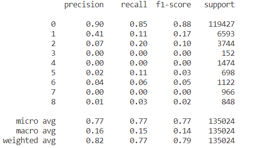

# IJCAI-2021-Continual-Activity-Recognition-Challenge (https://sites.google.com/view/sscl-workshop-ijcai-2021/)

The first proposed benchmark (MEVA-CL) is built on top of the MEVA (Multiview Extended Video with Activities) activity detection dataset (https://mevadata.org/), which we adapted to create the first benchmark for continual, long duration semi-supervised learning in a classification setting in which the purpose is to classify the input video frames in terms of activity classes.

Our MEVA-CL benchmark is composed by 15 sequences, broken down into three groups:

1. Continual_videos: Five 15-minute-long sequences from sites G326, G331, G341, G420, and G638 formed by three original videos which are contiguous.
2. Short_gap: Five 15-minute-long sequences from sites G329, G341, G420, G421, G638 formed by three videos separated by a short gap (5-20 minutes).
3. Long_gap: Five 15-minute-long sequences from sites G420, G421, G424, G506, and G638 formed by three original videos separated by a long gap (hours or days).

## Download
We release the videos and train annotations which can be download by changing your current directory to the Data directory and running the bash file [download_data.sh](./Data/download_data.sh) to automatically download the annotation files and video directory in the currect directory (Data).
```
cd Data
bash download_data.sh
```
OR 
You can download the all three groups videos and annotation from [Google-Drive link](https://drive.google.com/drive/folders/1z_fNoUySHeNy6CjgvWPMSP4sVuziEsR5?usp=sharing)

The annotation for validation and test set will be released in accordance with the [IJCAI 2021 CL Challenge](https://sites.google.com/view/sscl-workshop-ijcai-2021/).

## Preprocessing
After downloading all the groups it is important to convert all the videos into frames by changing the working directory to (./Data) and running the following commands:
```
cd Data
python generate_frames.py contiguous_videos/ && python generate_frames.py short_gap/ && python generate_frames.py long_gap/

```

## Training, Evaluation, and Self-Training 
### Training the baseline on train-split
```
### Training the baseline on train-split
python main.py --DATA_ROOT=Data\
    --SAVE_ROOT=Outputs --MODE=train --BATCH_SIZE=16\
    --VAL_BATCH_SIZE=4 --TEST_BATCH_SIZE=4\
    --NUM_WORKERS=8 --MAX_EPOCHS=15 --VAL_EPOCHS=1 --learning_rate=0.001 --device=cuda
```
   
### Evaluation the baseline on val-split   
```
python main.py --DATA_ROOT=Data\
    --SAVE_ROOT=Outputs --MODE=evaluate_val --BATCH_SIZE=16\
    --VAL_BATCH_SIZE=4 --TEST_BATCH_SIZE=4\
    --NUM_WORKERS=8 --MAX_EPOCHS=10 --VAL_EPOCHS=1 --learning_rate=0.001 --device=cuda
```    
### Evaluation the baseline on test-split 
```
python main.py --DATA_ROOT=Data\
    --SAVE_ROOT=Outputs --MODE=evaluate_test --BATCH_SIZE=16\
    --VAL_BATCH_SIZE=4 --TEST_BATCH_SIZE=4\
    --NUM_WORKERS=8 --MAX_EPOCHS=10 --VAL_EPOCHS=1 --learning_rate=0.001 --device=cuda  
```
### Self-training on val-split  
```
python main.py --DATA_ROOT=Data\
    --SAVE_ROOT=Outputs --MODE=self_val --BATCH_SIZE=16\
    --VAL_BATCH_SIZE=4 --TEST_BATCH_SIZE=4\
    --NUM_WORKERS=8 --MAX_EPOCHS=10 --VAL_EPOCHS=1 --learning_rate=0.001 --device=cuda
```
### Self-training on test-split  
```
python main.py --DATA_ROOT=Data\
    --SAVE_ROOT=Outputs --MODE=self_test --BATCH_SIZE=16\
    --VAL_BATCH_SIZE=4 --TEST_BATCH_SIZE=4\
    --NUM_WORKERS=8 --MAX_EPOCHS=10 --VAL_EPOCHS=1 --learning_rate=0.001 --device=cuda &&
```
### Self-training on val and test-split combine  
```
python main.py --DATA_ROOT=Data\
    --SAVE_ROOT=Outputs --MODE=self_val_test_combine --BATCH_SIZE=16\
    --VAL_BATCH_SIZE=4 --TEST_BATCH_SIZE=4\
    --NUM_WORKERS=8 --MAX_EPOCHS=10 --VAL_EPOCHS=1 --learning_rate=0.001 --device=cuda
```
### Arguments  
```
--DATA_ROOT       --> The directory to your pre-processed dataset
--SAVE_ROOT       --> The directory where you want to save the trained models and output json files
--MODE            --> Mode represent which specific section you want to run
    --train                 --> To train the model on supervised fold of the data
    --evaluate_val          --> To generate the prediction results for validation fold on supervised model
    --evaluate_test         --> To generate the prediction results for test fold on supervised model
    --self_val              --> To self train the supervised model on validation fold and generate the results
    --self_test             --> To self train the supervised model on test fold and generate the results
    --self_val_test_combine --> To self train the supervised model on validation and test folds together and generate the results

--BATCH_SIZE      --> Training batch size
--VAL_BATCH_SIZE  --> Validation/Self training batch size
--TEST_BATCH_SIZE --> Test batch size
--NUM_WORKERS     --> Number of worker to load data in parllel
--MAX_EPOCHS      --> Training epochs
--VAL_EPOCHS      --> Validation epochs
--learning_rate   --> Learning rate
--device          --> Using GPU or CPU 
```
## Results
### Results on val-split without self-training
<table style="width:100% th">
  <tr>
    <td>F1-score (macro-avgerage</td>
    <td>0.16</td> 
  </tr>
</table>

### Results on test-split without self-training
<table style="width:100% th">
  <tr>
    <td>F1-score (macro-avgerage</td>
    <td>0.14</td> 
  </tr>
</table>

### Results on val-split after self-training
<table style="width:100% th">
  <tr>
    <td>F1-score (macro-avgerage</td>
    <td>0.14</td> 
  </tr>
</table>

### Results on test-split after self-training
<table style="width:100% th">
  <tr>
    <td>F1-score (macro-avgerage</td>
    <td>0.14</td> 
  </tr>
</table>

### Results on val- and test-split combine after self-training
